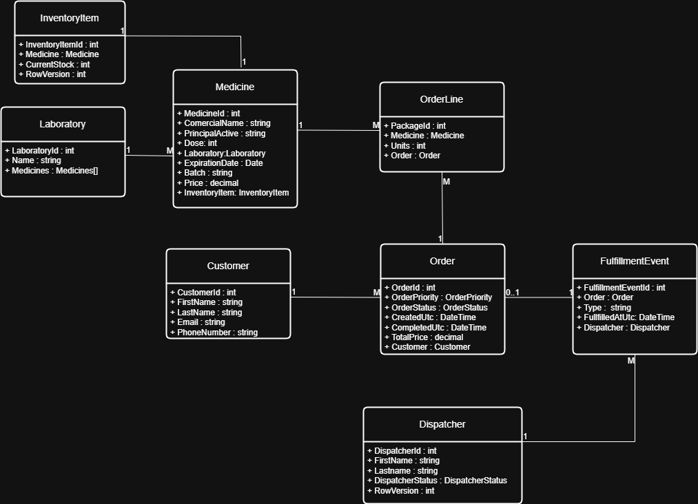

# Pharmacy Warehouse API
> A concurrent warehouse management API built with .NET Minimal API and EF Core for managing pharmaceutical inventory through a limited dispatcher workforce, ensuring inventory consistency and safe concurrent order processing.

## Table of Contents
 
1. [Project Overview](#1-project-overview)
2. [Business Domain](#2-business-domain)
3. [Technology Stack](#3-technology-stack)
4. [Architecture](#4-architecture)
5. [Domain Model](#5-domain-model)
6. [API Endpoints](#6-api-endpoints)
7. [Concurrency Strategy](#7-concurrency-strategy)
8. [Persistence](#8-persistence)
9. [Design Patterns](#9-design-patterns)
10. [Data Structures & Algorithms](#10-data-structures--algorithms)
11. [Benchmark](#11-benchmark)
12. [Logging & Observability](#12-logging--observability)
13. [Author](#13-author)

---

## 1. Project Overview

**Pharmacy Warehouse API** is a backend service that simulates the operations of a pharmaceutical warehouse responsible for fulfilling customer orders from a shared inventory. The system focuses on one of the most challenging problems in distributed inventory systems: processing multiple orders concurrently while guaranteeing inventory consistency and efficient workforce utilization.

The application prevents **inventory overselling** by ensuring that stock levels never fall below zero, even when multiple orders compete for the same products simultaneously. In addition, it manages a limited pool of warehouse dispatchers, guaranteeing that no dispatcher is assigned more than one order at a time while maintaining high throughput through concurrent processing.

Rather than being a simple CRUD application, the project models a production-oriented fulfillment workflow where inventory, order prioritization, transaction consistency, and concurrent workers interact in real time.

### Intended Users

The system is designed for several roles involved in warehouse operations:

- **Customers**, who submit product orders.
- **Warehouse administrators**, who monitor inventory levels, warehouse performance, and fulfillment metrics.
- **Warehouse dispatchers**, responsible for processing and fulfilling incoming orders.

### Core Features

The API provides endpoints for warehouse administration, fulfillment, reporting, and performance analysis, including:

- Reset the warehouse inventory to its initial state.
- Submit individual customer orders.
- Execute concurrent bursts of orders.
- Display the current inventory status.
- Report well-stocked, low-stock, and out-of-stock products.
- List fulfilled orders sorted by completion date.
- Generate rankings of the best-selling products.
- Search for the *N*th best-selling product using Binary Search over ranked results.
- Verify that no inventory overselling occurred during concurrent processing.
- Compare sequential and parallel execution performance through benchmarking.

### Technical Highlights

This project demonstrates several backend engineering concepts and modern .NET technologies, including:

- .NET Minimal API
- Entity Framework Core (Code First)
- SQL Server
- Docker
- Dependency Injection
- Factory Pattern
- Optimistic Concurrency
- Asynchronous Programming (async/await)
- LINQ
- Structured Logging with Serilog

### Engineering Challenges

The primary engineering goal of the project is to build a fulfillment service that remains **correct under concurrency**. The implementation addresses several real-world challenges:

- Prevent race conditions while updating shared inventory.
- Guarantee transactional consistency during order fulfillment.
- Process multiple customer requests concurrently without overselling products.
- Coordinate a limited pool of dispatchers so that each worker processes only one order at a time.
- Dequeue incoming orders according to priority while maximizing throughput and maintaining system correctness.

## 2. Business Domain
 
### Domain description
 
The system models a **pharmaceutical warehouse**: laboratories manufacture products, products are tracked as inventory items, customers place orders composed of one or more order lines, and dispatchers are responsible for fulfilling those orders — checking stock and executing the pick.
 
### Main entities
 
| Entity | Responsibility |
|---|---|
| `Laboratory` | Manufacturer of one or more `Product`s |
| `Product` | A specific medicine (commercial name, active ingredient, dose, batch, expiration date, price) |
| `InventoryItem` | Stock level for a `Product` (1:1), concurrency-guarded with `RowVersion` |
| `Customer` | Places `Order`s |
| `Order` | A request for one or more products, with `Priority` and `Status` |
| `OrderLine` | A single product + quantity within an `Order` |
| `Dispatcher` | Worker responsible for fulfilling orders; `Free`/`Busy`, concurrency-guarded with `RowVersion` |
| `FulfillmentEvent` | Append-only log entry: which `Order`, which `Dispatcher`, what happened, when |
 
### Business workflow
 
```
1. POST /orders/request
   → OrderFactory resolves each Batch to a ProductId
   → Order saved as Status = Pending
   → Order.Id enqueued in PriorityOrderQueue (Expedited before Normal)
   ← 201 Created (does NOT wait for fulfillment)
 
2. DispatcherWorkerService (background, one loop per Dispatcher)
   → loop pulls the next order from the queue when it has capacity
   → marks itself Busy (optimistic concurrency)
   → checks stock for every OrderLine
       - enough stock  → decrements InventoryItem, Status = Fulfilled
       - not enough    → Status = Backordered
   → writes a FulfillmentEvent (Order + Dispatcher + outcome)
   → marks itself Free, loops back to pull the next order
```
 
Two independent domain rules are enforced regardless of which path triggers a write:
 
- A `Product` can never be inserted with an `ExpirationDate` already in the past (`PharmacyDbContext.SaveChanges` override).
- A batch/SKU that doesn't resolve to an existing `Product` is rejected before an `Order` is ever created (`UnknownBatchException`).
---
 
## 3. Technology Stack
 
### Backend
- **.NET 10 / ASP.NET Core** — Minimal APIs
- **C#** with nullable reference types enabled
### Database
- **SQL Server**
- **Entity Framework Core** (Code First, `IEntityTypeConfiguration`-free — configuration lives inline in `OnModelCreating`)
### Logging
- **Serilog** (`Serilog.AspNetCore`) — Console + rolling File sinks, structured enrichment
### Development tools
- `dotnet-ef` CLI (migrations)
- Swagger / OpenAPI (`Swashbuckle.AspNetCore`) — Development environment only
---
 
## 4. Architecture
 
### Solution structure
 
```
Pharmacy.Data/
├── Entities/              # POCOs: Laboratory, Product, InventoryItem, Customer,
│                           # Order, OrderLine, Dispatcher, FulfillmentEvent + enums
├── Exceptions/             # DomainValidationException, UnknownBatchException
└── PharmacyDbContext.cs    # DbSets + Fluent API configuration + seed data +
                             # SaveChanges override (domain validation)
 
Pharmacy.Api/
├── Dtos/                   # OrderRequest, OrderLineRequest
├── Extensions/              # ServiceCollectionExtensions (DI wiring)
├── Queueing/
│   ├── PriorityOrderQueue.cs        # in-memory priority queue + completion tracking
│   └── DispatcherWorkerService.cs   # BackgroundService, one loop per Dispatcher
├── Services/
│   ├── IFulfillmentService / FulfillmentService
│   ├── OrderFactory
│   ├── BurstPlanner
│   ├── DispatcherAllocation      # static helpers: mark Busy/Free
│   ├── ISeeder / Seeder
└── Program.cs               # composition root + endpoints
```
 
### Layer responsibilities
 
| Layer | Owns |
|---|---|
| `Pharmacy.Data` | Entities, EF Core mapping, migrations, domain-level invariants enforced at the persistence boundary |
| `Pharmacy.Api` / Services | Business logic (fulfillment, order creation), orchestration |
| `Pharmacy.Api` / Queueing | Cross-cutting infrastructure: the worker pool and its coordination primitives |
| `Pharmacy.Api` / Program.cs | Composition root, HTTP surface — deliberately thin, delegates to services |
 
### Dependency flow
 
```
Pharmacy.Api  ──depends on──▶  Pharmacy.Data
```
 
One direction only. `Pharmacy.Data` has no knowledge of the API, the queue, or Serilog — it's a persistence-only project that could be reused by a different front end (a worker service, a CLI, a second API) without modification.
 
---
 
## 5. Domain Model
 
### Classes Diagram
 
`
 
### Relationships
 
| Relationship | Cardinality | FK owner |
|---|---|---|
| `Laboratory` → `Product` | 1:N | `Product.LaboratoryId` |
| `Product` ↔ `InventoryItem` | 1:1 | `InventoryItem.ProductId` (real FK) — `Product.InventoryId` is a plain, unconstrained column, kept for convenience |
| `Customer` → `Order` | 1:N | `Order.CustomerId` |
| `Order` → `OrderLine` | 1:N | `OrderLine.OrderId` (shadow-free, explicit) |
| `OrderLine` → `Product` | N:1, scalar-only | `OrderLine.ProductId` (no navigation property, by design) |
| `FulfillmentEvent` → `Order` | N:1, scalar-only | `FulfillmentEvent.OrderId` (append-only log, no navigation) |
| `FulfillmentEvent` → `Dispatcher` | N:1, scalar-only | `FulfillmentEvent.DispatcherId` |
 
**Notable design decision**: `Order` has **no foreign key to `Dispatcher`**. In the pull-queue model, the dispatcher that will process an order isn't known until a worker actually picks it up — so that assignment is recorded only as history, in `FulfillmentEvent.DispatcherId`, never as a live FK on `Order`.
 
### Database normalization
 
The schema is in **3NF**: every non-key attribute depends on the whole primary key and nothing but the key (e.g., `Order.TotalPrice` is a stored/derived value, not a hidden dependency on `OrderLine` data; `Product` and `InventoryItem` are split precisely because stock level changes at a different rate and under different concurrency rules than product metadata).

 
## 6. API Endpoints
 
| Endpoint | Method | Description |
|---|---|---|
| `/reports/inventory` | `GET` | Get complete inventory |
| `/reports/inventory/by-value` | `GET` | Group inventory by stock tier (`well-stocked` / `low`) |
| `/orders/request` | `POST` | Create a new order (validates batches, saves as `Pending`, enqueues it) |
| `/orders/burst` | `POST` | Seed and enqueue `n` test orders at once (worker/queue model demo) |
| `test/benchmark` | `POST` | Compare sequential vs. concurrent fulfillment throughput ([§11](#11-benchmark)) |
| `test/no-oversell` | `GET`  | A dedicated endpoint/test asserting no oversell occurs under concurrent load |
| `/reports/orders/by-completion` | `GET` | List orders sorted by completion time
| `/reports/products/top-selling` | `GET`  | Top-selling products |
| `/reports/products/{id}/ranking?units=x` | `GET` | Product ranking by units sold |
| `/inventory-reset` | `POST`  | Standalone inventory reset |

 
---
 
## 7. Concurrency Strategy
 
### The concurrency problem
 
Two failure modes had to be ruled out **structurally**, not just "usually avoided":
 
1. **Overselling**: two workers reading `InventoryItem.CurrentStock` at the same time, both seeing enough stock, both decrementing — net result: negative or wrong stock.
2. **Dispatcher double-booking**: two workers reading `Dispatcher.Status == Free` at the same time, both proceeding to assign themselves the same order.
A naive `SELECT` then `UPDATE` (read-then-write) is unsafe for both cases under real concurrent load — the window between the read and the write is exactly where the race happens.
 
### Solution
 
**Optimistic concurrency via EF Core's `RowVersion` (SQL Server `rowversion`/timestamp column)** on both `InventoryItem` and `Dispatcher`:
 
- Every write carries the version it was read with. SQL Server rejects the update if the row changed in between (`DbUpdateConcurrencyException`).
- On conflict, `FulfillmentService.SaveWithRetryAsync` re-reads the current database values, re-validates the business condition against the **fresh** value (e.g., "is there still enough stock?"), and retries — rather than blindly overwriting or failing outright.
- `DispatcherAllocation.TryMarkBusyAsync` applies the same pattern to claim a dispatcher: read `Free`, attempt to write `Busy`, and if the save fails on concurrency, the claim simply didn't happen — no lock ever held, no deadlock possible.
**Producer/consumer decoupling** via `PriorityOrderQueue` (see [§10](#10-data-structures--algorithms)) means order creation never blocks on fulfillment, and fulfillment throughput scales with the number of `Dispatcher` workers — not with the number of concurrent HTTP requests creating orders.
 
This combination gives **correctness without pessimistic locking**: no `SELECT ... FOR UPDATE`, no application-level mutexes around shared rows, no risk of deadlocking two workers against each other — contention is resolved by retry, not by blocking.
 
---
 
## 8. Persistence
 
### EF Core
`PharmacyDbContext` maps all eight entities via Fluent API inside `OnModelCreating`, grouped per entity (`b.Entity<T>(e => { ... })`).
 
### Code First
Entities are plain C# classes; the schema is derived from them and from the Fluent API configuration — no hand-written SQL DDL.
 
### Migrations
Managed via `dotnet-ef`:
```bash
dotnet ef migrations add <Name> --project Warehouse.Data --startup-project Warehouse.Api
dotnet ef database update --project Warehouse.Data --startup-project Warehouse.Api
```
 
### Seed data
`OnModelCreating` seeds a baseline dataset via `HasData()`: 2 laboratories, 3 products (with varying stock levels, including a deliberately low-stock one to exercise the `Backordered` path), 2 customers, 2 dispatchers, and sample orders/order lines/fulfillment events.
 
### Transactions
Each `SaveChangesAsync()` call is implicitly transactional (EF Core's default behavior) — an `Order` status change and its corresponding `FulfillmentEvent` insert either both commit or both roll back together. The `SaveChanges`/`SaveChangesAsync` overrides additionally enforce the "no expired products" domain rule before any write reaches the database.
 
> **📎 Technical Appendix — how this project meets these goals**
> - Fluent API config: `Warehouse.Data/PharmacyDbContext.cs`, `OnModelCreating`
> - Domain validation on write: `PharmacyDbContext.SaveChanges(bool)` / `SaveChangesAsync(bool, CancellationToken)` → `ValidateNewProductsExpirationDate()`
> - Seed data: same file, `// Data Seeding` section (`HasData` calls per entity)
> - Concurrency tokens: `InventoryItem.RowVersion`, `Dispatcher.RowVersion`, configured via `.IsRowVersion()`
 
---
 
## 9. Design Patterns
 
### Factory
`OrderFactory` centralizes `Order` construction from raw request data, resolving batches to `ProductId`s and mapping `kind` (`"normal"` / `"expedited"`) to `OrderPriority` — callers never build an `Order` graph by hand.
 
### Dependency Injection
Constructor injection throughout, with lifetimes chosen deliberately (not just defaulted):
- `PharmacyDbContext` — **Scoped**
- `IDbContextFactory<PharmacyDbContext>` — used wherever a component needs to create contexts on demand (background loops, parallel operations)
- `IFulfillmentService`, `OrderFactory`, `BurstPlanner`, `ISeeder` — **Scoped**
- `PriorityOrderQueue` — **Singleton** (shared process state)
- `DispatcherWorkerService` — **Singleton** hosted service, resolves its Scoped dependencies via `IServiceScopeFactory`
### Exception Handling
A small domain exception hierarchy (`DomainValidationException` → `UnknownBatchException`) lets endpoints distinguish "this is a client input problem" (→ `400 Bad Request`) from unexpected infrastructure failures (→ unhandled, logged, `500`).
 
### Logging
Structured logging via injected `ILogger<T>` inside services (`FulfillmentService`, `DispatcherWorkerService`, `Seeder`), and Serilog's static `Log` at the composition-root/endpoint level — see [§12](#12-logging--observability).
 
> **📎 Technical Appendix — how this project meets these goals**
> - Factory: `Warehouse.Api/Services/OrderFactory.cs`
> - DI registration: `Warehouse.Api/Extensions/ServiceCollectionExtensions.cs` (`AddPersistence`, `AddApplicationServices`)
> - Exceptions: `Warehouse.Data/Exceptions/DomainValidationException.cs`, `UnknownBatchException.cs`
> - Exception → HTTP mapping example: `Program.cs`, `POST /orders/request` `catch (UnknownBatchException ex)`
 
---
 
## 10. Data Structures & Algorithms
 
### Priority Queue
`PriorityOrderQueue` wraps .NET's built-in `PriorityQueue<int, int>`, ranking `Expedited` orders (`0`) ahead of `Normal` (`1`), guarded by a `SemaphoreSlim` for async-friendly blocking dequeue.
 
### Dictionary
- `ConcurrentDictionary<string, int>` caches `Batch → ProductId` resolution in `FulfillmentService` (rebuilt per scope).
- `ConcurrentDictionary<int, TaskCompletionSource<FulfillmentResult>>` in `PriorityOrderQueue` tracks pending completions for callers using `EnqueueAndWaitAsync`.
### Binary Search
No explicit in-memory binary search is implemented; instead, the equivalent capability is delegated to the database: every lookup that matters for performance (`Batch` resolution, `Order.Status`/`Priority` filtering, `FulfillmentEvent` history) is backed by a SQL Server index (B-tree), giving **O(log n)** seeks rather than table scans — see indexes in [§5](#5-domain-model).
 
### Sorting
`BurstPlanner.OrderByPriority` sorts orders `Expedited`-first, then oldest-first within each priority (`OrderBy` + `ThenBy`, a stable sort — .NET's LINQ `OrderBy` is implemented as a stable sort).
 
### Big-O analysis
 
| Operation | Complexity | Notes |
|---|---|---|
| `PriorityOrderQueue.Enqueue` / `DequeueAsync` | O(log n) | Binary heap under `PriorityQueue<TElement, TPriority>` |
| `ConcurrentDictionary` lookups (batch→id, pending completions) | O(1) average | Hash table |
| `BurstPlanner.OrderByPriority` | O(n log n) | Comparison-based sort over the batch |
| Batch/index-backed EF Core queries | O(log n) per seek | SQL Server B-tree index, not a full scan |
| `FulfillOneAsync` per order | O(k) | k = number of `OrderLine`s in that order (bounded, small) |
 
> **📎 Technical Appendix — how this project meets these goals**
> - Priority queue: `Warehouse.Api/Queueing/PriorityOrderQueue.cs`
> - Dictionaries: `FulfillmentService._batchToProductId`, `PriorityOrderQueue._pending`
> - Sorting: `Warehouse.Api/Services/BurstPlanner.cs`
> - Indexed lookups: `Warehouse.Data/PharmacyDbContext.cs`, `HasIndex(...)` calls
 
---
 
## 11. Benchmark
 
`POST /benchmark?n={count}` measures fulfillment throughput two ways, **using the exact same underlying mechanism** (`PriorityOrderQueue` + `DispatcherWorkerService`) for both — the only variable is *when* work is submitted:
 
### Sequential execution
Enqueues one order, waits for it to be fully processed (`EnqueueAndWaitAsync`), then enqueues the next. At any instant, at most one order is in flight — even with multiple dispatchers available, only one is ever exercised at a time.
 
### Parallel execution
Enqueues all `n` orders at once and awaits them together (`Task.WhenAll`). Every available `Dispatcher` competes for work concurrently, exactly as it would under real concurrent traffic.
 
### Results
The endpoint returns:
```json
{
  "n": 100,
  "sequentialMs": 61234,
  "concurrentMs": 30102,
  "difference": -31132,
  "concurrentResult": { "fulfilled": 91, "backordered": 9 }
}
```
*(illustrative — see your own run for actual numbers)*
 
### Speedup
Expected speedup is **bounded by the number of `Dispatcher` rows** in the database, not by `n` — two dispatchers won't get you close to a 10x speedup no matter how large `n` is (Amdahl's law in practice: the serial portion here is "one dispatcher's worth of work," and there are only so many dispatchers). To see a larger gap, seed more dispatchers before running the benchmark.
 
> **📎 Technical Appendix — how this project meets these goals**
> - Endpoint: `Program.cs`, `POST /benchmark`
> - Shared mechanism: `FulfillmentService.FulfillWithAnyAvailableDispatcherAsync`, `FulfillmentService.FulfillBurstAsync`
> - Inventory reset between runs for a fair comparison: `ISeeder.ResetAndCreateOrders`
 
---
 
## 12. Logging & Observability
 
### Serilog configuration
Two-stage initialization: a **bootstrap logger** (console-only) captures failures that happen before configuration is even loaded, then `Host.UseSerilog(...)` reconfigures logging from `appsettings.json` (`Serilog` section) once the full DI container is available.
 
### Structured logging
Log calls use message templates with named properties (e.g., `"Fulfilled order {OrderId}, {LineCount} lines, dispatcher {DispatcherId}"`) rather than string interpolation — every log event is queryable by field, not just full-text-searchable.
 
### Log examples
```
[INF] Iniciando Warehouse API
[INF] Order 1042 created and enqueued (Expedited)
[INF] Dispatcher 1 worker loop started
[INF] Dispatcher 2 worker loop started
[INF] Dispatcher 1 is marked as busy
[INF] Fulfilled order: 1042, 1 lines, dispatcher 1
[INF] Dispatcher 1 is marked as free
[WRN] Backordered 1043: insufficient stock
[ERR] Dispatcher 2 worker loop error
```
 
### Shutdown behavior
`DispatcherWorkerService` loops honor `CancellationToken` for graceful shutdown (breaking out of their `while` loop rather than being torn down mid-write). The composition root wraps startup in `try/catch/finally`, guaranteeing `Log.CloseAndFlush()` runs even if the host fails to start — no buffered log entries lost on a crashed startup.
 
> **📎 Technical Appendix — how this project meets these goals**
> - Bootstrap + full logger setup: `Program.cs`, top of file and `builder.Host.UseSerilog(...)`
> - Sinks/enrichers configuration: `appsettings.json`, `Serilog` section
> - Per-request logging: `app.UseSerilogRequestLogging()`
> - Graceful worker shutdown: `Warehouse.Api/Queueing/DispatcherWorkerService.cs`, `RunDispatcherLoopAsync`
 
---
 
## 13. Author
 
*Luis Hernández, .NET Developer*